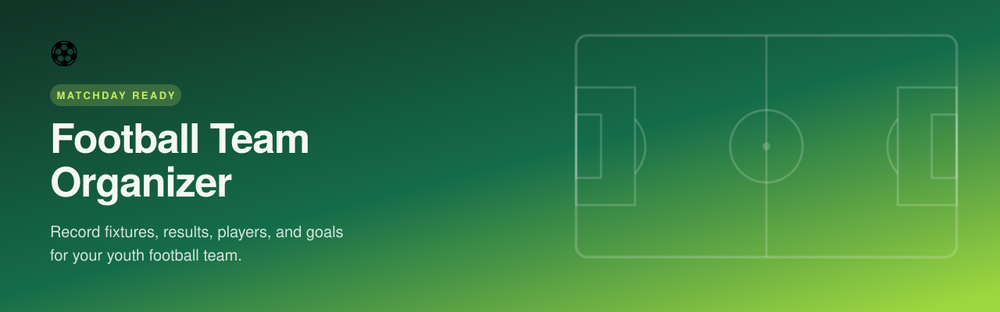
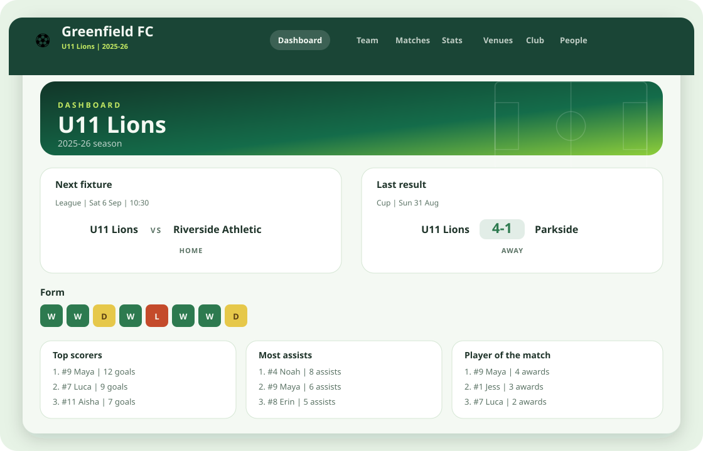

  

<h1 align="center">Football Team Organizer</h1>

  <strong>Record fixtures, results, players, and goals for your youth football team.</strong>

  
  

  <a href="#what-you-can-do">Features</a> ·
  <a href="#who-its-for">Roles</a> ·
  <a href="docs/development.md">Development</a> ·
  <a href="docs/deployment.md">Deploy</a>

---

A club-coloured home for grassroots football. Coaches run the match day, management looks after the club, and families stay in the loop — squad, fixtures, scores, and stats in one place.

  

## What you can do

<table>
  <tr>
    <td width="50%" valign="top">
      <h3>Dashboard</h3>
      
Next fixture, last result, recent form, competitions, and leaderboards on a pitch-green home screen.

    </td>
    <td width="50%" valign="top">
      <h3>Team</h3>
      
Roster, coaches, training nights, competitions, and player of the month — switch age groups from the header.

    </td>
  </tr>
  <tr>
    <td width="50%" valign="top">
      <h3>Matches</h3>
      
Fixtures and results with squads, periods, goals, assists, cards, and player of the match. Live scoring when the game is on.

    </td>
    <td width="50%" valign="top">
      <h3>Stats</h3>
      
Goals, assists, appearances, awards, and form across the season — filter by competition when you need the detail.

    </td>
  </tr>
  <tr>
    <td width="50%" valign="top">
      <h3>Club &amp; people</h3>
      
One club, many teams. Invite managers, coaches, guardians, and players. Club colours and crest carry through the app.

    </td>
    <td width="50%" valign="top">
      <h3>Venues</h3>
      
Pitches with surface, parking, and food notes, so away days are less of a surprise.

    </td>
  </tr>
</table>

## Who it's for

| Role                   | On match day                                     |
| ---------------------- | ------------------------------------------------ |
| **Management**         | The whole club — teams, people, and invitations  |
| **Coach**              | Squad, fixtures, scores, and player of the match |
| **Guardian assistant** | Help record the match: squad, goals, cards       |
| **Guardian**           | Follow their player's team, results, and stats   |
| **Player**             | Their teams, fixtures, and their own profile     |

Access is invite-only. Sensitive contact details stay with the people who need them. Full permission notes live in [`docs/roles.md`](docs/roles.md).

## Club identity

Each club can set a crest and a club colour. The header, cards, and pitch wash pick it up so the app feels like _your_ club, not a generic spreadsheet.

## Run it yourself

This repository is the app. To stand up your own club instance:

| Guide | What you need |
| --- | --- |
| **Local** | Node.js, a Supabase project, and a few env vars — [`docs/development.md`](docs/development.md) |
| **Production** | Vercel + hosted Supabase, auth URLs, and email templates — [`docs/deployment.md`](docs/deployment.md) |

## Documentation

| Document | Contents |
| --- | --- |
| [`docs/product.md`](docs/product.md) | Product brief — what the app does and who it's for |
| [`docs/roles.md`](docs/roles.md) | Role definitions and permission detail |
| [`docs/architecture.md`](docs/architecture.md) | System design, components, key decisions |
| [`docs/database.md`](docs/database.md) | Data model and RLS strategy |
| [`docs/development.md`](docs/development.md) | Local setup, testing, branching |
| [`docs/deployment.md`](docs/deployment.md) | Environments, CI/CD, Vercel and Supabase configuration |
| [`docs/configuration.md`](docs/configuration.md) | Environment variables |
| [`docs/operations.md`](docs/operations.md) | Database backups and restore |
| [`docs/security.md`](security.md) | Vulnerability reporting and security guidelines |

## License

[MIT](LICENSE) © Tommy Armstrong
